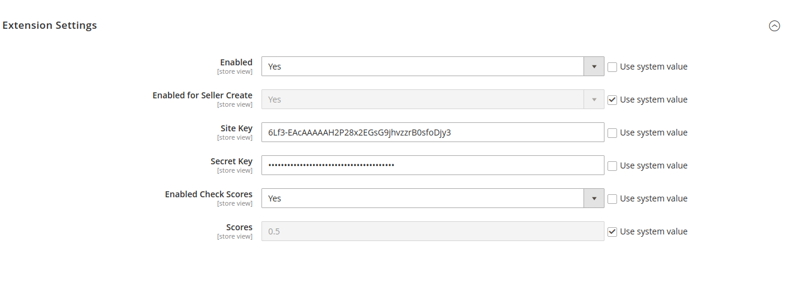

# Magento 2 Marketplace Recaptcha

Magento 2 module that adds the Google Recaptcha on Seller Create Account, Contact Form, Customer create and Forgot Password pages.


## Screenshot


## Register

You need to register your site with Google Recaptcha.

https://www.google.com/recaptcha/

Under Stores -> Configuration -> Services -> Recaptcha Configuration -> Extension Settings

Enabled -> Yes  
Site Key -> from Recaptcha website  
Secret Key -> from Recaptcha website


## Install

#### Composer

```bash
composer require landofcoder/module-seller-recaptcha
```

Enable Module

```php
php bin/magento module:enable Lof_MarketPlaceRecaptcha

php bin/magento setup:upgrade --keep-generated

php bin/magento setup:di:compile
```

You may need to Flush Magento Cache after installation.